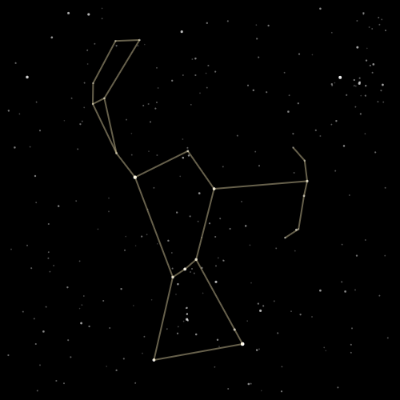

# react-constellation-sketcher

> React Component for drawing constellations, wrapping [Constellation Sketcher](https://github.com/svank/constellation-sketcher)

[](https://www.npmjs.com/package/react-constellation-sketcher)

[Live demo](https://samvankooten.net/constellation_sketcher)

Static screenshot:



## Install

```bash
npm install --save react-constellation-sketcher
```

## Usage

```jsx
import React, { Component } from 'react'

import ConstellationSketcher from 'react-constellation-sketcher'

class Example extends Component {
  render() {
    return <ConstellationSketcher width="500"
                                  height="500"
                                  slideshow={true}
                                  ...
            />
  }
}
```

Every [configuration option](https://github.com/svank/constellation-sketcher#configuration) in the underlying library maps to a React prop---just remove the "set" prefix and make the first letter lowercase. The `animated` prop replaces the `setAnimated` function, `drawLines` replaces `setDrawLines`, etc. The only differences are:

 * `setCrossFade` and `setFadeIn` are broken into the props `crossFade`, `crossFadeTime`, `fadeIn`, and `fadeInTime`.
* Random selection weights are set via the `weights` prop, which should be set to an object where the keys are some or all of `all`, `popular`, `striking`, `medium`, or `small`. E.g. `weights={{'all': 0, 'striking': 1}}` will ensure only *striking* constellations are chosen, and `weights={{'medium': 0}}` will block *medium* constellations from being chosen while leaving the other categories at their default weights.

The `width` and `height` props control the size of the component (square aspect ratios are recommended), and the `style` prop is passed through to the underlying `<canvas>` element.

The `constellation` prop sets the constellation to be shown (or the first constellation for a slideshow). If not given, a random constellation is chosen.

The `slideshow` prop sets whether successive constellations are shown (default `false`).

---

The list of constellation names and the constellation categories are availble:
```
import ConstellationSketcher, {constellationNames, categories} from 'react-constellation-sketcher'
```
